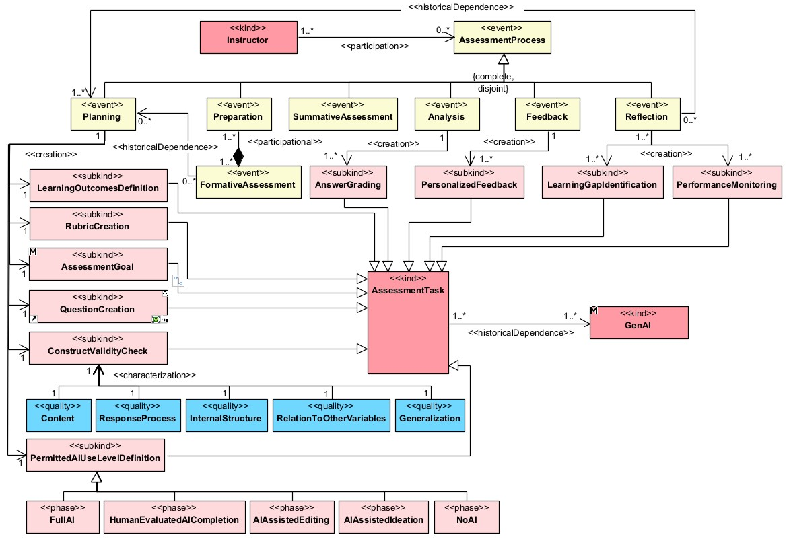
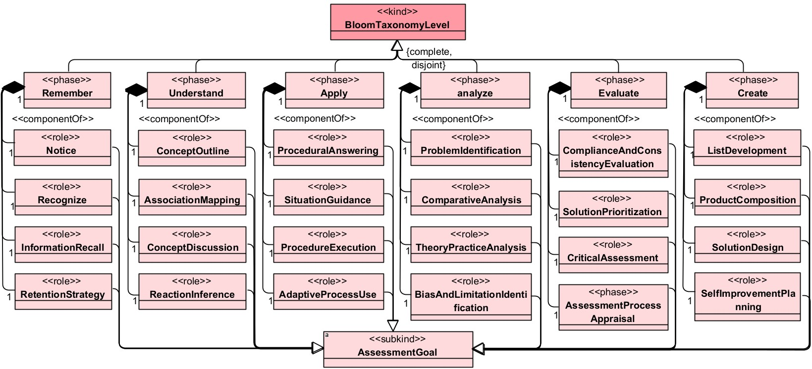
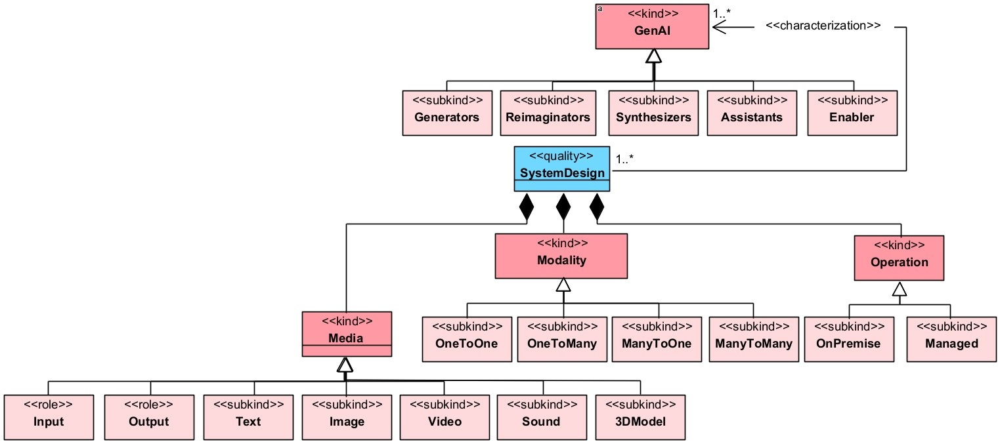

# OntoAvalIA

  
  

A `OntoAvalIA` é uma ontologia educacional voltada ao apoio de professores no planejamento e na condução de processos avaliativos mediados ou apoiados por Inteligência Artificial Generativa (IAGen). A proposta relaciona atividades do processo avaliativo, níveis da Taxonomia Revisada de Bloom, objetivos de avaliação e formas permitidas de uso de IA.

A ontologia busca tornar explícitas perguntas como:

- qual objetivo avaliativo está associado a uma tarefa;
- qual nível cognitivo da Taxonomia de Bloom é mobilizado;
- como a IA pode apoiar uma atividade sem substituir indevidamente a autoria ou o julgamento humano;
- quais feedbacks e lacunas de aprendizagem podem ser identificados a partir da avaliação.

## 1. Objetivo

O objetivo da `OntoAvalIA` é representar formalmente conceitos e relações necessários para recomendar e analisar usos de IAGen em atividades avaliativas, considerando os níveis cognitivos e objetivos de avaliação da Taxonomia Revisada de Bloom e o tipo e o limite de participação da IA na atividade.

## 2. Escopo
Avaliação da aprendizagem no ensino superior a distância, apoiada por ferramentas de Inteligência Artificial Generativa (IAGen) e orientada pela supervisão humana, abrangendo o planejamento, a aplicação, a análise de resultados, a produção de feedback e a reflexão sobre o processo avaliativo.

## 3. Usuários e usos pretendidos

### 3.1. Usuários finais

| Usuário | Necessidade apoiada pela ontologia |
|---|---|
| Professores, especialmente em educação a distância | Planejar atividades avaliativas e selecionar usos pedagogicamente adequados de IA. |
| Gestores de instituições de ensino | Orientar práticas de avaliação mediadas por IAGen e apoiar diretrizes institucionais. |
| Desenvolvedores de AVAs e softwares educativos | Implementar módulos de recomendação, configuração e rastreabilidade de usos de IA em avaliações. |
| Pesquisadores em educação e informática na educação | Investigar relações entre objetivos cognitivos, avaliação e IAGen. |

### 3.2. Usos pretendidos

| Código | Uso pretendido | Descrição |
|---|---|---|
| `UP1` | Referência conceitual para avaliação mediada por IAGen | Proporcionar uma visão estruturada dos elementos envolvidos em avaliações apoiadas por IA. |
| `UP2` | Melhoria das práticas avaliativas | Apoiar a seleção de formas de uso da IA coerentes com objetivos de aprendizagem e critérios avaliativos. |
| `UP3` | Desenvolvimento de software educacional | Subsidiar a implementação de módulos avaliativos ou plugins para AVAs. |

## 4. Fundamentação conceitual

A ontologia articula quatro eixos centrais:

| Eixo | Referências |
|---|---|
| Processo avaliativo | As etapas do processo avaliativo foram adaptadas do modelo proposto por Ilieva et al. (2025). |
| Taxonomia Revisada de Bloom | Os objetivos de avaliação associados aos níveis de Bloom foram adaptados do framework proposto por Page, Meyers e Krahe Billings (2024). |
| Inteligência Artificial Generativa | A taxonomia dos tipos de IAGen utilizada foi adaptada do trabalho de Strobel et al. (2024). |
| Responsabilidade humana | Os limites de uso de IAGen foram definidos com base na escala proposta por Perkins et al. (2024). |
| Validade do Construto | Os critérios de qualidade do construto avaliativo apoiado por IAGen foram definidos com base no trabalho de Kaldaras, Akaeze e Reckase (2024). |

## 5. Requisitos Não Funcionais

Os requisitos não funcionais estabelecem características de qualidade, fundamentação ontológica e acessibilidade que devem orientar o desenvolvimento, a documentação e a disponibilização da ontologia.

| ID | Requisito Não Funcional | Descrição | Critério de Verificação |
|---|---|---|---|
| RNF1 | Disponibilização em repositório público | A ontologia e seus artefatos associados deverão ser disponibilizados publicamente em um repositório no GitHub. | Existência de repositório público contendo arquivos da ontologia, documentação, licença e orientações de uso. |
| RNF2 | Fundamentação na UFO | A modelagem conceitual da ontologia deverá utilizar a Unified Foundational Ontology (UFO) como ontologia de fundamentação. | Identificação dos conceitos fundamentados em categorias da UFO e disponibilização do modelo conceitual correspondente, preferencialmente em OntoUML. |
| RNF3 | Documentação bilíngue | A documentação principal da ontologia deverá estar disponível em português e inglês. | Existência de documentação nos dois idiomas, incluindo apresentação, escopo, classes principais, relações e instruções de uso. |

## 6. Requisitos Funcionais - Questões de competência

As questões de competência orientam a modelagem e poderão ser utilizadas na validação da ontologia.

| ID | Questão de competência |
|---|---|
| `CQ01` | Quais `AssessmentTask` ocorrem em `AssessmentProcessStage`? |
| `CQ02` | Quais `AIUseLevel` são recomendados para `AssessmentTask`? |
| `CQ03` | Quais `GenAI` apoiam `AssessmentTask`? |
| `CQ04` | Quais  `ConstructValidityCheck` são considerados em `AssessmentTask`? |

## 7. Visão geral do modelo

### 7.1. Classes Centrais

| Classe | Termo em português | Descrição |
|---|---|---|
| `Instructor` | Professor | Agente responsável pelo planejamento, condução ou avaliação da aprendizagem. |
| `AssessmentTask` | Tarefa avaliativa | Atividade proposta para produzir evidências de aprendizagem. |
| `GenAI` | Tarefa avaliativa | Atividade proposta para produzir evidências de aprendizagem. |

### 7.2. Etapas Avaliativas

| Classe | Termo em português | Descrição |
|---|---|---|
| `AssessmentProcess` | Etapas do processo de avaliação da aprendizagem. |
| `Planning` | Etapas do processo de avaliação da aprendizagem. |
| `LearningOutcomesDefinition` | Definição dos resultados de aprendizagem de aprendizagem | Processo de estabelecer resultados de aprendizagem que orientam atividades e avaliações. |
| `RubricCreation` | Criação de rubricas | Processo de elaborar critérios e níveis de desempenho para uma avaliação. |
| `AssessmentGoal` | Objetivo da avaliação | Finalidade avaliativa associada a um nível de Bloom e a uma dimensão do conhecimento. |
| `QuestionCreation` | Criação de questões | Processo de formular perguntas ou itens de uma tarefa avaliativa. |
| `PermittedAIUseLevelDefinition` | Definição dos níveis permitidos de uso de IA | Processo de estabelecer limites e formas autorizadas de participação da IA. |
| `Preparation` | Preparation. |
| `FormativeAssessment` | Preparation. |
| `SummativeAssessment` | Preparation. |
| `Analysis` | Preparation. |
| `AnswerGrading` | Correção de respostas | Processo de examinar respostas e emitir julgamento avaliativo. |
| `Feedback` | Preparation. |
| `Reflection` | Preparation. |
| `AssessmentTask` | Tarefa avaliativa | Atividade proposta para produzir evidências de aprendizagem. |
| `PersonalizedFeedback` | Feedback personalizado | Retorno avaliativo adaptado às evidências e necessidades de um estudante. |
| `LearningGap` | Lacuna de aprendizagem | Conhecimento, habilidade ou aspecto do desempenho que demanda desenvolvimento. |

## 8. Visão Níveis da Taxonomia de Bloom

### 8.1. Classes Centrais

| Classe | Significado |
|---|---|
| `BloomTaxonomyLevel` | Nível cognitivo da Taxonomia Revisada de Bloom utilizado para organizar a complexidade das atividades avaliativas. |
| `AssessmentGoal` | Objetivo avaliativo associado a um nível cognitivo, indicando a finalidade da atividade de avaliação. |

---

### 8.2. Remember — Lembrar

| Classe | Significado |
|---|---|
| `Notice` | Identificação inicial de itens, informações ou comportamentos presentes em uma situação. |
| `Recognize` | Reconhecimento de exemplos, categorias ou padrões previamente apresentados. |
| `InformationRecall` | Recordação de termos, definições ou informações anteriormente estudadas. |
| `RetentionStrategy` | Identificação de estratégias para melhorar a retenção de informações. |

### 8.3. Understand — Compreender

| Classe | Significado |
|---|---|
| `ConceptOutline` | Identificação e síntese dos principais conceitos de um conteúdo. |
| `AssociationMapping` | Organização de informações por associação, classificação ou relação temática. |
| `ConceptDiscussion` | Explicação e discussão de conceitos para demonstrar compreensão. |
| `ReactionInference` | Inferência de reações pessoais ou profissionais diante de uma situação. |

### 8.4. Apply — Aplicar

| Classe | Significado |
|---|---|
| `ProceduralAnswering` | Utilização de conhecimentos para responder a questões procedimentais em situações práticas. |
| `SituationGuidance` | Recomendação da melhor forma de agir diante de uma situação contextualizada. |
| `ProcedureExecution` | Execução de processos, uso de ferramentas ou resolução de problemas. |
| `AdaptiveProcessUse` | Seleção ou adaptação de processos conforme necessidades e características do contexto. |

### 8.5. Analyze — Analisar

| Classe | Significado |
|---|---|
| `ProblemIdentification` | Identificação e organização de problemas relevantes em determinado contexto. |
| `ComparativeAnalysis` | Comparação, diferenciação e classificação de ideias, elementos ou perspectivas. |
| `TheoryPracticeAnalysis` | Análise crítica da aplicação de fundamentos teóricos em situações práticas. |
| `BiasAndLimitationIdentification` | Identificação de vieses, limitações ou restrições presentes em determinada perspectiva. |

### 8.6. Evaluate — Avaliar

| Classe | Significado |
|---|---|
| `ComplianceAndConsistencyEvaluation` | Verificação da conformidade de procedimentos e da consistência de fontes ou ações. |
| `SolutionPrioritization` | Identificação e priorização da solução ou processo mais adequado. |
| `CriticalAssessment` | Produção de julgamentos fundamentados, críticas ou justificativas sobre um produto ou desempenho. |
| `AssessmentProcessAppraisal` | Reflexão crítica sobre processos, estratégias ou experiências avaliativas. |

### 8.7. Create — Criar

| Classe | Significado |
|---|---|
| `ListDevelopment` | Desenvolvimento de lista original de ideias ou alternativas. |
| `ProductComposition` | Organização de inter-relações para constituir um produto final. |
| `SolutionDesign` | Invenção ou proposição de plano ou solução. |
| `SelfImprovementPlanning` | Mapeamento de transformações pessoais e planejamento de melhorias. |

## 9. Visão IAGen

### 9.1. Classes Centrais

| Classe | Significado |
|---|---|
| `GenAI` | IA Generativa (IAGen) |
| `SystemDesign` | Classificação dos tipos de IAGen de acordo com o design do sistema |

---

### 9.2. Subtipos de IAGen

#### 9.2.1 Media - De acordo com o tipo de mídia de entrada e/ou saída

| Classe | Significado |
|---|---|
| `Media` | Tipo de mídia aceita. |
| `Input` | Mídia de entrada. |
| `Output` | Mídia de Saída. |
| `Text` | Conteúdo em formato de texto. |
| `Image` | Conteúdo em formato de imagem. |
| `Video` | Conteúdo em formato de vídeo. |
| `Sound` | Conteúdo em formato de áudio. |
| `3DModel` | Conteúdo em formato de modelo 3D. |

#### 9.2.1 Modality - De acordo com a modalidade

| Classe | Significado |
|---|---|
| `Modality` | Diz respeito a quantos tipos de dados podem ser manipulados simultaneamente. |
| `OneToOne` | Aplicações um-para-um processamuma entrada para gerar uma saída. |
| `OneToMany` | Aplicações classificadas como um‑para‑muitos produzem diversas saídas, como descrições em texto e imagens, a partir de uma mesma entrada única. |
| `ManyToOne` | Aplicações muitos‑para‑um processam múltiplas entradas de forma integrada para gerar uma saída. |
| `ManyToMany` | Aplicações muitos‑para‑muitos processam múltiplas entradas de forma integrada para gerar saídas diversas. |

#### 9.2.1 Operation - De acordo com o tipo de operação

| Classe | Significado |
|---|---|
| `Operation` | Se refere a como a aplicação será implementada. |
| `OnPremisse` | aplicação local. |
| `Managed` | Aplicação hospedada em uma plataforma de terceiros. |

## Relações previstas

A tabela apresenta propriedades candidatas para a implementação em OWL/RDF. As relações devem ser confirmadas durante a formalização da ontologia.

| Estereótipo | Significado |
|---|---|
| `componentOf` | Indica que o professor realiza uma atividade de planejamento ou avaliação. |
| `historicalDependence` | Indica que o professor realiza uma atividade de planejamento ou avaliação. |
| `creation` | Indica que o professor realiza uma atividade de planejamento ou avaliação. |
| `participation` | Indica que o professor realiza uma atividade de planejamento ou avaliação. |
| `participational` | Indica que o professor realiza uma atividade de planejamento ou avaliação. |

## Licença

A licença da ontologia e de sua documentação deve ser definida antes da publicação. Para artefatos acadêmicos e vocabulários reutilizáveis, uma alternativa comum é a licença [Creative Commons Attribution 4.0 International](https://creativecommons.org/licenses/by/4.0/), desde que compatível com as decisões do autor e da instituição.

Substitua esta seção pela licença efetivamente adotada e inclua o arquivo `LICENSE` na raiz do repositório.

## Referências

ILIEVA, Galina et al. A framework for generative AI-driven assessment in higher education. Information, v. 16, n. 6, p. 472, 2025.

KALDARAS, Leonora; AKAEZE, Hope O.; RECKASE, Mark D. Developing valid assessments in the era of generative artificial intelligence. In: Frontiers in education. Frontiers Media SA, 2024. p. 1399377.

PAGE, Eric; MEYERS, Gretchen; BILLINGS, Eve Krahe. Theory to Practice: A Framework for Generative AI. Intersection: A Journal at the Intersection of Assessment and Learning, v. 5, n. 4, p. 114-126, 2024.

PERKINS, M. et al. The AI Assessment Scale (AIAS): A framework for ethical integration of generative AI in educational assessment (2023). arXiv [em linha].

STROBEL, Gero et al. Exploring generative artificial intelligence: A taxonomy and types. 2024.

