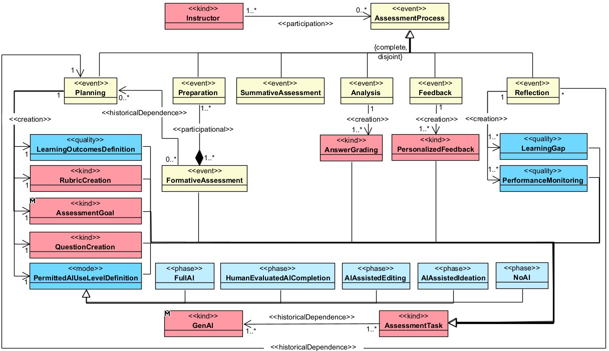

# OntoAvalIA

<p align="center">
  Ontologia para apoiar o planejamento e a avaliação da aprendizagem com uso responsável de Inteligência Artificial Generativa
</p>

<p align="center">
  
  
  
  
</p>

> `OntoAvalIA` é um nome provisório para a ontologia. Ele pode ser substituído pelo nome oficial do projeto antes da publicação do repositório.

## Sumário

- [Sobre a ontologia](#sobre-a-ontologia)
- [Objetivo](#objetivo)
- [Escopo](#escopo)
- [Usuários e usos pretendidos](#usuários-e-usos-pretendidos)
- [Fundamentação conceitual](#fundamentação-conceitual)
- [Questões de competência](#questões-de-competência)
- [Visão geral do modelo](#visão-geral-do-modelo)
- [Classes principais](#classes-principais)
- [Objetivos de avaliação por nível de Bloom](#objetivos-de-avaliação-por-nível-de-bloom)
- [Relações previstas](#relações-previstas)
- [Exemplo de aplicação](#exemplo-de-aplicação)
- [Como utilizar](#como-utilizar)
- [Estrutura recomendada do repositório](#estrutura-recomendada-do-repositório)
- [Artefatos e documentação](#artefatos-e-documentação)
- [Convenções de nomenclatura](#convenções-de-nomenclatura)
- [Validação e evolução](#validação-e-evolução)
- [Como citar](#como-citar)
- [Contribuição](#contribuição)
- [Licença](#licença)
- [Referências](#referências)

## Sobre a ontologia

A `OntoAvalIA` é uma ontologia educacional voltada ao apoio de professores no planejamento e na condução de processos avaliativos mediados ou apoiados por Inteligência Artificial Generativa (IAGen). A proposta relaciona atividades do processo avaliativo, níveis da Taxonomia Revisada de Bloom, objetivos de avaliação e formas permitidas de uso de IA.

A ontologia busca tornar explícitas perguntas como:

- qual objetivo avaliativo está associado a uma tarefa;
- qual nível cognitivo da Taxonomia de Bloom é mobilizado;
- como a IA pode apoiar uma atividade sem substituir indevidamente a autoria ou o julgamento humano;
- quais feedbacks e lacunas de aprendizagem podem ser identificados a partir da avaliação.

## Objetivo

O objetivo da `OntoAvalIA` é representar formalmente conceitos e relações necessários para recomendar e analisar usos de IAGen em atividades avaliativas, considerando:

1. o planejamento de objetivos, questões e rubricas;
2. os níveis cognitivos e objetivos de avaliação da Taxonomia Revisada de Bloom;
3. o tipo e o limite de participação da IA na atividade;
4. a correção de respostas, a identificação de lacunas e a oferta de feedback personalizado.

## Escopo

### Incluído no domínio

- planejamento de objetivos de aprendizagem;
- elaboração de rubricas e questões avaliativas;
- definição de níveis permitidos de uso de IA;
- tarefas avaliativas formativas e somativas;
- níveis e objetivos de avaliação associados à Taxonomia Revisada de Bloom;
- modalidades de assistência por IAGen;
- correção, feedback personalizado e identificação de lacunas de aprendizagem.

### Fora do escopo atual

- implementação de detectores de plágio ou de texto produzido por IA;
- avaliação automática definitiva sem supervisão humana;
- representação detalhada de políticas institucionais específicas;
- modelagem completa de competências colaborativas ou socioemocionais, que poderá ser incorporada em versões futuras.

## Usuários e usos pretendidos

### Usuários finais

| Usuário | Necessidade apoiada pela ontologia |
|---|---|
| Professores, especialmente em educação a distância | Planejar atividades avaliativas e selecionar usos pedagogicamente adequados de IA. |
| Gestores de instituições de ensino | Orientar práticas de avaliação mediadas por IAGen e apoiar diretrizes institucionais. |
| Desenvolvedores de AVAs e softwares educativos | Implementar módulos de recomendação, configuração e rastreabilidade de usos de IA em avaliações. |
| Pesquisadores em educação e informática na educação | Investigar relações entre objetivos cognitivos, avaliação e IAGen. |

### Usos pretendidos

| Código | Uso pretendido | Descrição |
|---|---|---|
| `UP1` | Referência conceitual para avaliação mediada por IAGen | Proporcionar uma visão estruturada dos elementos envolvidos em avaliações apoiadas por IA. |
| `UP2` | Melhoria das práticas avaliativas | Apoiar a seleção de formas de uso da IA coerentes com objetivos de aprendizagem e critérios avaliativos. |
| `UP3` | Desenvolvimento de software educacional | Subsidiar a implementação de módulos avaliativos ou plugins para AVAs. |

## Fundamentação conceitual

A ontologia articula quatro eixos centrais:

| Eixo | Papel na ontologia |
|---|---|
| Processo avaliativo | Representa planejamento, tarefa, correção, feedback e identificação de lacunas. |
| Taxonomia Revisada de Bloom | Organiza níveis cognitivos e objetivos de avaliação. |
| Inteligência Artificial Generativa | Representa formas de apoio da IA na geração, edição ou conclusão de tarefas. |
| Responsabilidade humana | Preserva a definição dos limites de uso, a supervisão e o julgamento avaliativo. |

Os objetivos de avaliação associados aos níveis de Bloom foram adaptados da coluna `Goal of Assessment` do *Assessment Framework for Generative AI*, proposta por Page, Meyers e Krahe Billings (2024).

## Questões de competência

As questões de competência orientam a modelagem e poderão ser utilizadas na validação da ontologia.

| ID | Questão de competência |
|---|---|
| `CQ01` | Quais objetivos de aprendizagem estão associados a uma tarefa avaliativa? |
| `CQ02` | Qual nível da Taxonomia de Bloom é trabalhado por uma tarefa avaliativa? |
| `CQ03` | Quais objetivos de avaliação podem ser mobilizados em determinado nível de Bloom? |
| `CQ04` | Quais formas de uso de IA são permitidas em uma tarefa avaliativa? |
| `CQ05` | Qual tipo de assistência de IA é compatível com determinado objetivo de avaliação? |
| `CQ06` | Quais tarefas permitem ideação assistida por IA? |
| `CQ07` | Quais tarefas permitem edição assistida por IA? |
| `CQ08` | Em quais tarefas a IA pode executar uma produção desde que haja avaliação humana? |
| `CQ09` | Quais rubricas e questões foram criadas para avaliar determinado objetivo de aprendizagem? |
| `CQ10` | Qual feedback personalizado foi produzido a partir da correção de uma resposta? |
| `CQ11` | Quais lacunas de aprendizagem foram identificadas para um estudante? |
| `CQ12` | Quais atividades avaliativas demandam revisão humana obrigatória do conteúdo produzido com IA? |

## Visão geral do modelo



## Classes principais

### Planejamento, atores e artefatos avaliativos

| Classe | Termo em português | Descrição |
|---|---|---|
| `Teacher` | Professor | Agente responsável pelo planejamento, condução ou avaliação da aprendizagem. |
| `LearningObjectiveDefinition` | Definição dos objetivos de aprendizagem | Processo de estabelecer resultados de aprendizagem que orientam atividades e avaliações. |
| `RubricCreation` | Criação de rubricas | Processo de elaborar critérios e níveis de desempenho para uma avaliação. |
| `QuestionCreation` | Criação de questões | Processo de formular perguntas ou itens de uma tarefa avaliativa. |
| `PermittedAIUseLevelDefinition` | Definição dos níveis permitidos de uso de IA | Processo de estabelecer limites e formas autorizadas de participação da IA. |
| `AssessmentTask` | Tarefa avaliativa | Atividade proposta para produzir evidências de aprendizagem. |
| `AnswerGrading` | Correção de respostas | Processo de examinar respostas e emitir julgamento avaliativo. |
| `PersonalizedFeedback` | Feedback personalizado | Retorno avaliativo adaptado às evidências e necessidades de um estudante. |
| `LearningGap` | Lacuna de aprendizagem | Conhecimento, habilidade ou aspecto do desempenho que demanda desenvolvimento. |

### Uso de IA no processo avaliativo

| Classe | Termo em português | Descrição |
|---|---|---|
| `AIAssistedIdeation` | Ideação assistida por IA | Uso da IA para gerar, explorar ou organizar ideias iniciais. |
| `AIAssistedEditing` | Edição assistida por IA | Uso da IA para revisar, aperfeiçoar ou reorganizar conteúdo produzido. |
| `HumanEvaluatedAICompletion` | Execução pela IA com avaliação humana | Uso em que a IA realiza parte ou toda a tarefa, com análise crítica humana do resultado. |

### Estruturas cognitivas e avaliativas

| Classe | Termo em português | Descrição |
|---|---|---|
| `BloomTaxonomyLevel` | Nível da Taxonomia de Bloom | Categoria cognitiva: recordar, compreender, aplicar, analisar, avaliar ou criar. |
| `CognitiveProcessVerb` | Verbo do processo cognitivo | Verbo que expressa a ação cognitiva esperada em um objetivo de aprendizagem. |
| `AssessmentGoal` | Objetivo da avaliação | Finalidade avaliativa associada a um nível de Bloom e a uma dimensão do conhecimento. |

## Objetivos de avaliação por nível de Bloom

As classes desta seção podem ser especializações de `AssessmentGoal`.


### Remember — Recordar

| Classe | Significado |
|---|---|
| `Itemization` | Enumeração de itens relevantes. |
| `Recognition` | Reconhecimento de ocorrências, exemplos ou padrões. |
| `Recall` | Recordação de informações previamente aprendidas. |
| `RetentionStrategy` | Identificação ou uso de estratégias para retenção de informações. |

### Understand — Compreender

| Classe | Significado |
|---|---|
| `ConceptOutline` | Esquematização ou síntese de conceitos-chave. |
| `AssociationMapping` | Organização ou identificação de itens por associação. |
| `ConceptDiscussion` | Explicação e discussão de um conceito. |
| `ReactionInference` | Inferência de reação diante de informação ou situação. |

### Apply — Aplicar

| Classe | Significado |
|---|---|
| `ProceduralAnswering` | Resposta a questões relativas a procedimentos. |
| `SituationGuidance` | Escolha ou recomendação da melhor forma de agir em uma situação. |
| `ProcedureExecution` | Execução de procedimento, uso de programa ou resolução de problema. |
| `AdaptiveProcessUse` | Emprego do processo mais adequado às necessidades ou habilidades envolvidas. |

### Analyze — Analisar

| Classe | Significado |
|---|---|
| `ProblemIdentification` | Identificação de problemas ou seleção de um conjunto mais completo de problemas. |
| `ComparativeAnalysis` | Comparação, contraste, classificação, distinção ou exame de um fenômeno. |
| `TheoryPracticeAnalysis` | Análise crítica da aplicação prática de uma teoria. |
| `BiasAndLimitationIdentification` | Identificação de vieses e limitações de perspectiva. |

### Evaluate — Avaliar

| Classe | Significado |
|---|---|
| `ComplianceAndConsistencyEvaluation` | Avaliação do cumprimento de procedimentos e da consistência de fontes ou evidências. |
| `SolutionPrioritization` | Seleção e priorização da melhor solução ou processo. |
| `CriticalAssessment` | Avaliação, síntese, interpretação, justificativa ou crítica. |
| `AssessmentProcessAppraisal` | Julgamento ou reflexão sobre o próprio processo avaliativo. |

### Create — Criar

| Classe | Significado |
|---|---|
| `ListDevelopment` | Desenvolvimento de lista original de ideias ou alternativas. |
| `ProductComposition` | Organização de inter-relações para constituir um produto final. |
| `SolutionDesign` | Invenção ou proposição de plano ou solução. |
| `SelfImprovementPlanning` | Mapeamento de transformações pessoais e planejamento de melhorias. |

## Relações previstas

A tabela apresenta propriedades candidatas para a implementação em OWL/RDF. As relações devem ser confirmadas durante a formalização da ontologia.

| Propriedade | Domínio | Alcance | Significado |
|---|---|---|---|
| `performs` | `Teacher` | Processo avaliativo | Indica que o professor realiza uma atividade de planejamento ou avaliação. |
| `guides` | `LearningObjectiveDefinition` | `AssessmentTask` | Indica que a definição de objetivo orienta a tarefa avaliativa. |
| `hasGoal` | `AssessmentTask` | `AssessmentGoal` | Associa uma tarefa ao seu objetivo de avaliação. |
| `targetsBloomLevel` | `AssessmentTask` | `BloomTaxonomyLevel` | Relaciona a tarefa ao nível cognitivo pretendido. |
| `expressedBy` | `AssessmentGoal` | `CognitiveProcessVerb` | Indica o verbo cognitivo que expressa o objetivo. |
| `allowsAIUse` | `AssessmentTask` | Uso de IA | Relaciona a tarefa ao tipo de participação de IA autorizado. |
| `hasPermittedAIUseLevel` | `AssessmentTask` | `PermittedAIUseLevelDefinition` | Associa a tarefa ao limite definido para uso de IA. |
| `evaluatedThrough` | `AssessmentTask` | `AnswerGrading` | Relaciona uma tarefa ao processo de correção. |
| `producesFeedback` | `AnswerGrading` | `PersonalizedFeedback` | Indica o feedback resultante da correção. |
| `identifiesGap` | `AnswerGrading` | `LearningGap` | Indica a lacuna identificada na avaliação. |

## Exemplo de aplicação

### Cenário

Um professor define uma tarefa na qual o estudante deve propor uma solução para um problema educacional. O professor permite que a IA seja utilizada para geração inicial de ideias, mas exige que o produto final seja elaborado e justificado pelo estudante.

### Instâncias conceituais

| Elemento | Exemplo de instância | Classe |
|---|---|---|
| Professor | `teacherHeraldo` | `Teacher` |
| Tarefa | `proposeEducationalSolutionTask` | `AssessmentTask` |
| Nível de Bloom | `createLevel` | `BloomTaxonomyLevel` |
| Objetivo de avaliação | `solutionDesignGoal` | `SolutionDesign` |
| Uso permitido de IA | `ideaGenerationSupport` | `AIAssistedIdeation` |
| Feedback | `solutionJustificationFeedback` | `PersonalizedFeedback` |

### Representação ilustrativa em Turtle

```turtle
@prefix ontoavalia: <https://example.org/ontoavalia#> .

ontoavalia:teacherHeraldo a ontoavalia:Teacher ;
    ontoavalia:performs ontoavalia:solutionTaskPlanning .

ontoavalia:proposeEducationalSolutionTask a ontoavalia:AssessmentTask ;
    ontoavalia:hasGoal ontoavalia:solutionDesignGoal ;
    ontoavalia:targetsBloomLevel ontoavalia:createLevel ;
    ontoavalia:allowsAIUse ontoavalia:ideaGenerationSupport .

ontoavalia:solutionDesignGoal a ontoavalia:SolutionDesign .
ontoavalia:createLevel a ontoavalia:BloomTaxonomyLevel .
ontoavalia:ideaGenerationSupport a ontoavalia:AIAssistedIdeation .
```

> A URI `https://example.org/ontoavalia#` é ilustrativa e deve ser substituída pelo namespace oficial após a publicação da ontologia.

## Como utilizar

### Para professores

1. Defina o objetivo de aprendizagem da atividade.
2. Selecione o nível de Bloom e o objetivo avaliativo correspondente.
3. Determine se a IAGen será permitida e em qual modalidade.
4. Crie questões e rubricas coerentes com os objetivos selecionados.
5. Utilize o modelo para orientar correção, feedback e identificação de lacunas.

### Para desenvolvedores

1. Utilize o arquivo OWL/RDF da ontologia como vocabulário de domínio.
2. Associe tarefas do AVA aos níveis de Bloom, objetivos avaliativos e modalidades de IA.
3. Implemente consultas para recomendar tipos de assistência ou identificar incompatibilidades.
4. Registre feedbacks e lacunas sem automatizar decisões críticas sem supervisão humana.

### Para pesquisadores

1. Utilize as questões de competência para avaliar cobertura conceitual.
2. Proponha extensões, como competências colaborativas, políticas institucionais ou evidências de aprendizagem.
3. Registre novos cenários de uso e resultados de validação na pasta `validation/`.

## Estrutura recomendada do repositório

```text
ontoavalia/
├── README.md
├── LICENSE
├── CITATION.cff
├── ontology/
│   ├── ontoavalia.owl
│   ├── ontoavalia.ttl
│   └── ontoavalia.jsonld
├── docs/
│   ├── glossary.md
│   ├── competency-questions.md
│   ├── conceptual-model.md
│   └── methodology.md
├── diagrams/
│   ├── ontoavalia-ontouml.svg
│   └── assessment-goal-hierarchy.svg
├── examples/
│   ├── assessment-task-example.ttl
│   └── sparql-queries.md
├── validation/
│   ├── cq-validation-results.md
│   └── expert-evaluation.md
└── references/
    └── sources.bib
```

## Artefatos e documentação

| Artefato | Caminho sugerido | Status |
|---|---|---|
| Página principal do projeto | `README.md` | Disponível nesta versão inicial |
| Glossário de classes | `docs/glossary.md` | Elaborado |
| Questões de competência | `docs/competency-questions.md` | Versão inicial disponível nesta página |
| Modelo conceitual OntoUML | `diagrams/ontoavalia-ontouml.svg` | A desenvolver |
| Implementação OWL | `ontology/ontoavalia.owl` | A desenvolver |
| Serialização Turtle | `ontology/ontoavalia.ttl` | A desenvolver |
| Consultas SPARQL de validação | `examples/sparql-queries.md` | A desenvolver |
| Resultados de validação com especialistas | `validation/expert-evaluation.md` | A desenvolver |

## Convenções de nomenclatura

| Elemento | Convenção | Exemplo |
|---|---|---|
| Classes | Inglês e `PascalCase` | `AssessmentTask` |
| Propriedades de objeto | Inglês e `camelCase` | `hasGoal` |
| Propriedades de dados | Inglês e `camelCase` | `hasDescription` |
| Instâncias | Inglês e `camelCase` | `createLevel` |
| Prefixo sugerido | Minúsculas | `ontoavalia:` |
| Termos em português | Documentados como rótulos | `rdfs:label "Tarefa avaliativa"@pt` |

### Nomes alternativos registrados durante a modelagem

<details>
<summary>Visualizar termos alternativos e refinamentos</summary>

| Nome | Uso ou observação |
|---|---|
| `Instructor` | Alternativa a `Teacher` para representar o docente responsável por uma disciplina. |
| `ImprovementAreaIdentification` | Nome inicial para identificação de pontos a melhorar. |
| `GapIdentification` | Alternativa para o processo de detectar lacunas. |
| `ImprovementNeed` | Alternativa quando se representa a necessidade identificada e não o processo. |
| `AIAssistedIdeaGenerationAndStructuring` | Nome expandido refinado para `AIAssistedIdeation`. |
| `AICompletionWithHumanEvaluation` | Nome inicial refinado para `HumanEvaluatedAICompletion`. |
| `KnowledgeDimensionVerb` | Nome inicial substituído por `CognitiveProcessVerb`, mais coerente com Bloom. |
| `RetentionTechniqueIdentification` | Nome processual sintetizado como `RetentionStrategy`. |
| `KeyConceptOutlining` | Nome processual sintetizado como `ConceptOutline`. |
| `AssociationBasedIdentification` | Nome inicial sintetizado como `AssociationMapping`. |
| `ConceptExplanationAndDiscussion` | Nome inicial sintetizado como `ConceptDiscussion`. |
| `PersonalReactionInference` | Nome expandido sintetizado como `ReactionInference`. |
| `ProceduralQuestionAnswering` | Nome expandido sintetizado como `ProceduralAnswering`. |
| `ProcedureExplanation` | Alternativa quando se deseja representar explicação de procedimento. |

</details>

## Validação e evolução

A evolução da ontologia poderá seguir um ciclo iterativo de especificação, conceptualização, formalização, implementação e avaliação. As seguintes estratégias são previstas:

| Estratégia | Finalidade |
|---|---|
| Validação por questões de competência | Verificar se a ontologia responde às perguntas definidas para o domínio. |
| Avaliação por especialistas | Analisar clareza, relevância e suficiência dos conceitos e relações. |
| Verificação lógica | Avaliar consistência, restrições e inferências na implementação OWL. |
| Cenários de uso | Observar a aplicabilidade em tarefas avaliativas reais ou simuladas. |
| Revisão de terminologia | Ajustar nomes, definições e hierarquias conforme evidências e feedback. |

### Estado atual

| Dimensão | Estado |
|---|---|
| Definição inicial do domínio | Concluída |
| Glossário inicial de classes | Concluído |
| Objetivos de avaliação vinculados a Bloom | Concluídos em nível conceitual |
| Relações iniciais | Propostas, aguardando validação |
| Modelo OntoUML completo | Em elaboração |
| Implementação OWL/RDF | Planejada |
| Validação com especialistas | Planejada |

## Como citar

Enquanto a ontologia estiver em desenvolvimento e sem publicação formal, recomenda-se utilizar a seguinte referência provisória, ajustando ano, URL e versão no momento de disponibilização pública:

```bibtex
@misc{ontoavalia2026,
  author       = {Lima Junior, Heraldo Gonçalves},
  title        = {OntoAvalIA: Ontologia para Avaliação da Aprendizagem com Inteligência Artificial Generativa},
  year         = {2026},
  howpublished = {Repositório GitHub},
  note         = {Versão em desenvolvimento},
  url          = {INSERIR_URL_DO_REPOSITORIO}
}
```

### Citação do framework que fundamenta os objetivos avaliativos

```bibtex
@article{page2024assessmentframework,
  author  = {Page, Eric and Meyers, Gretchen and Krahe Billings, Eve},
  title   = {Theory to Practice: An Assessment Framework for Generative AI},
  journal = {Intersection: A Journal at the Intersection of Assessment and Learning},
  volume  = {5},
  number  = {4},
  pages   = {114--126},
  year    = {2024}
}
```

## Contribuição

Contribuições podem incluir:

- sugestão de novas classes, propriedades ou definições;
- revisão das questões de competência;
- proposição de cenários avaliativos com uso responsável de IAGen;
- submissão de consultas SPARQL e testes de validação;
- revisão linguística dos rótulos em português e inglês.

Ao publicar o repositório, recomenda-se disponibilizar um arquivo `CONTRIBUTING.md` com orientações para abertura de *issues* e envio de *pull requests*.

## Licença

A licença da ontologia e de sua documentação deve ser definida antes da publicação. Para artefatos acadêmicos e vocabulários reutilizáveis, uma alternativa comum é a licença [Creative Commons Attribution 4.0 International](https://creativecommons.org/licenses/by/4.0/), desde que compatível com as decisões do autor e da instituição.

Substitua esta seção pela licença efetivamente adotada e inclua o arquivo `LICENSE` na raiz do repositório.

## Financiamento e agradecimentos

Preencher esta seção conforme as fontes de financiamento e apoios efetivamente associados ao desenvolvimento da ontologia. Quando aplicável, inserir o agradecimento institucional à CAPES conforme a redação exigida para a produção científica vinculada ao financiamento.

## Referências

- Anderson, L. W., Krathwohl, D. R., Airasian, P. W., Cruikshank, K. A., Mayer, R. E., Pintrich, P. R., Raths, J., & Wittrock, M. C. (2001). *A taxonomy for learning, teaching, and assessing: A revision of Bloom’s taxonomy of educational objectives*. Longman.
- Page, E., Meyers, G., & Krahe Billings, E. (2024). Theory to practice: An assessment framework for generative AI. *Intersection: A Journal at the Intersection of Assessment and Learning, 5*(4), 114–126.

---

<p align="center">
  Ontologia em desenvolvimento para apoiar avaliações educacionais transparentes, pedagogicamente coerentes e responsáveis no contexto da IA generativa.
</p>


# Glossário de classes para a ontologia de avaliação com IA generativa

## Escopo

Este glossário reúne os nomes de classes produzidos durante a modelagem da ontologia. Os identificadores são apresentados em inglês, no padrão `PascalCase`, para uso em modelos conceituais, OntoUML ou implementação posterior em OWL/RDF.

Os nomes relacionados aos objetivos de avaliação foram traduzidos e sintetizados a partir da coluna `Goal of Assessment` do framework de Page, Meyers e Krahe Billings (2024), organizada segundo os níveis da Taxonomia Revisada de Bloom.

## Classes recomendadas

### Planejamento, atores e artefatos avaliativos

| Classe | Significado em português | Definição para a ontologia |
|---|---|---|
| `LearningObjectiveDefinition` | Definição dos objetivos de aprendizagem | Processo de estabelecer os resultados de aprendizagem que orientarão atividades e avaliações. |
| `RubricCreation` | Criação de rubricas | Processo de elaborar critérios e níveis de desempenho para orientar a avaliação. |
| `QuestionCreation` | Criação de questões | Processo de formular perguntas ou itens que compõem uma tarefa avaliativa. |
| `PermittedAIUseLevelDefinition` | Definição dos níveis permitidos de uso de IA | Processo de estabelecer limites e formas autorizadas de uso de IA em uma avaliação. |
| `Teacher` | Professor | Agente docente responsável pelo planejamento, condução ou avaliação da aprendizagem. |
| `AssessmentTask` | Tarefa avaliativa | Atividade proposta ao estudante para produzir evidências de aprendizagem. |
| `AnswerGrading` | Correção de respostas | Processo de examinar e atribuir julgamento avaliativo às respostas apresentadas. |
| `PersonalizedFeedback` | Feedback personalizado | Retorno avaliativo adaptado às evidências, necessidades ou desempenho de um estudante. |
| `LearningGap` | Lacuna de aprendizagem | Necessidade de desenvolvimento identificada no conhecimento ou desempenho do estudante. |

### Uso de inteligência artificial no processo avaliativo

| Classe | Significado em português | Definição para a ontologia |
|---|---|---|
| `AIAssistedIdeation` | Ideação assistida por IA | Uso de IA para gerar, explorar ou organizar ideias iniciais para uma tarefa. |
| `AIAssistedEditing` | Edição assistida por IA | Uso de IA para revisar, aperfeiçoar ou reorganizar um conteúdo produzido. |
| `HumanEvaluatedAICompletion` | Execução pela IA com avaliação humana | Situação em que a IA executa parte ou toda a tarefa e uma pessoa avalia criticamente o resultado. |

### Estruturas da Taxonomia de Bloom

| Classe | Significado em português | Definição para a ontologia |
|---|---|---|
| `BloomTaxonomyLevel` | Nível da Taxonomia de Bloom | Categoria do processo cognitivo, como recordar, compreender, aplicar, analisar, avaliar ou criar. |
| `CognitiveProcessVerb` | Verbo do processo cognitivo | Verbo que expressa a ação cognitiva esperada do estudante em um objetivo de aprendizagem. |
| `AssessmentGoal` | Objetivo da avaliação | Finalidade avaliativa associada a um nível de Bloom e a uma dimensão do conhecimento. |

## Objetivos de avaliação associados à Taxonomia de Bloom

As classes a seguir podem ser modeladas como especializações de `AssessmentGoal`.

### Remember - Recordar

| Classe | Significado em português | Definição para a ontologia |
|---|---|---|
| `Itemization` | Enumeração de itens | Objetivo de listar ou enumerar elementos relevantes. |
| `Recognition` | Reconhecimento | Objetivo de reconhecer ou observar ocorrências, exemplos ou padrões. |
| `Recall` | Recordação | Objetivo de recuperar informações previamente aprendidas. |
| `RetentionStrategy` | Estratégia de retenção | Objetivo de identificar ou empregar técnicas que favoreçam a retenção de informações. |

### Understand - Compreender

| Classe | Significado em português | Definição para a ontologia |
|---|---|---|
| `ConceptOutline` | Esquematização de conceitos | Objetivo de delinear ou sintetizar os conceitos-chave de um conteúdo. |
| `AssociationMapping` | Mapeamento por associação | Objetivo de organizar ou identificar itens por relações de associação. |
| `ConceptDiscussion` | Discussão de conceito | Objetivo de explicar e discutir um conceito para demonstrar compreensão. |
| `ReactionInference` | Inferência de reação | Objetivo de inferir reações pessoais diante de informações ou situações. |

### Apply - Aplicar

| Classe | Significado em português | Definição para a ontologia |
|---|---|---|
| `ProceduralAnswering` | Resposta a questões procedimentais | Objetivo de responder a questões sobre etapas, métodos ou procedimentos. |
| `SituationGuidance` | Orientação para situação | Objetivo de recomendar ou escolher a melhor forma de agir em uma situação. |
| `ProcedureExecution` | Execução de procedimento | Objetivo de seguir processos, usar programas, solucionar problemas ou realizar tarefas. |
| `AdaptiveProcessUse` | Uso adaptativo de processo | Objetivo de empregar o processo mais adequado às necessidades ou habilidades envolvidas. |

### Analyze - Analisar

| Classe | Significado em português | Definição para a ontologia |
|---|---|---|
| `ProblemIdentification` | Identificação de problemas | Objetivo de identificar problemas ou selecionar conjuntos de problemas mais completos. |
| `ComparativeAnalysis` | Análise comparativa | Objetivo de comparar, contrastar, classificar, distinguir ou examinar partes de um fenômeno. |
| `TheoryPracticeAnalysis` | Análise da teoria na prática | Objetivo de decompor e analisar criticamente a aplicação prática de uma teoria. |
| `BiasAndLimitationIdentification` | Identificação de vieses e limitações | Objetivo de reconhecer vieses e limites associados a uma perspectiva. |

### Evaluate - Avaliar

| Classe | Significado em português | Definição para a ontologia |
|---|---|---|
| `ComplianceAndConsistencyEvaluation` | Avaliação de conformidade e consistência | Objetivo de verificar a execução de procedimentos e a consistência das fontes ou evidências. |
| `SolutionPrioritization` | Priorização de soluções | Objetivo de discernir e priorizar a melhor solução ou processo disponível. |
| `CriticalAssessment` | Avaliação crítica | Objetivo de avaliar, sintetizar, interpretar, concluir, justificar ou criticar. |
| `AssessmentProcessAppraisal` | Apreciação do processo avaliativo | Objetivo de julgar ou refletir sobre o próprio processo de avaliação. |

### Create - Criar

| Classe | Significado em português | Definição para a ontologia |
|---|---|---|
| `ListDevelopment` | Desenvolvimento de lista | Objetivo de produzir uma lista original de ideias, tópicos ou alternativas. |
| `ProductComposition` | Composição de produto | Objetivo de organizar intencionalmente inter-relações para constituir um produto final. |
| `SolutionDesign` | Projeto de solução | Objetivo de inventar ou propor um plano ou solução. |
| `SelfImprovementPlanning` | Planejamento de autoaperfeiçoamento | Objetivo de mapear mudanças pessoais e planejar melhorias. |

## Hierarquia sugerida para `AssessmentGoal`

```mermaid
classDiagram
    class AssessmentGoal
    AssessmentGoal <|-- Itemization
    AssessmentGoal <|-- Recognition
    AssessmentGoal <|-- Recall
    AssessmentGoal <|-- RetentionStrategy
    AssessmentGoal <|-- ConceptOutline
    AssessmentGoal <|-- AssociationMapping
    AssessmentGoal <|-- ConceptDiscussion
    AssessmentGoal <|-- ReactionInference
    AssessmentGoal <|-- ProceduralAnswering
    AssessmentGoal <|-- SituationGuidance
    AssessmentGoal <|-- ProcedureExecution
    AssessmentGoal <|-- AdaptiveProcessUse
    AssessmentGoal <|-- ProblemIdentification
    AssessmentGoal <|-- ComparativeAnalysis
    AssessmentGoal <|-- TheoryPracticeAnalysis
    AssessmentGoal <|-- BiasAndLimitationIdentification
    AssessmentGoal <|-- ComplianceAndConsistencyEvaluation
    AssessmentGoal <|-- SolutionPrioritization
    AssessmentGoal <|-- CriticalAssessment
    AssessmentGoal <|-- AssessmentProcessAppraisal
    AssessmentGoal <|-- ListDevelopment
    AssessmentGoal <|-- ProductComposition
    AssessmentGoal <|-- SolutionDesign
    AssessmentGoal <|-- SelfImprovementPlanning
```



## Nomes alternativos ou refinados durante a modelagem

| Classe gerada | Significado em português | Observação de modelagem |
|---|---|---|
| `Instructor` | Professor/instrutor | Alternativa a `Teacher` quando o ator representa especificamente o docente responsável por uma disciplina ou atividade. |
| `ImprovementAreaIdentification` | Identificação de pontos a melhorar | Nome inicial para o processo de identificar áreas passíveis de melhoria. |
| `GapIdentification` | Identificação de lacunas | Alternativa reduzida para o processo de detectar lacunas de aprendizagem. |
| `WeaknessIdentification` | Identificação de fragilidades | Alternativa com ênfase em dificuldades; uso menos recomendado por possuir conotação negativa. |
| `ImprovementIdentification` | Identificação de melhorias | Alternativa curta para representar a identificação de possibilidades de melhoria. |
| `ImprovementNeed` | Necessidade de melhoria | Alternativa para representar o resultado identificado, em vez do processo de identificação. |
| `AIAssistedIdeaGenerationAndStructuring` | Geração e estruturação de ideias assistidas por IA | Nome expandido posteriormente reduzido para `AIAssistedIdeation`. |
| `AICompletionWithHumanEvaluation` | Realização da tarefa pela IA com avaliação humana | Nome inicial posteriormente refinado para `HumanEvaluatedAICompletion`. |
| `KnowledgeDimensionVerb` | Verbo da dimensão do conhecimento | Nome inicialmente proposto; substituído conceitualmente por `CognitiveProcessVerb`, pois os verbos se vinculam ao processo cognitivo. |
| `RetentionTechniqueIdentification` | Identificação de técnicas de retenção | Nome de processo associado ao objetivo posteriormente sintetizado como `RetentionStrategy`. |
| `KeyConceptOutlining` | Delineamento de conceitos-chave | Nome de processo associado ao objetivo posteriormente sintetizado como `ConceptOutline`. |
| `AssociationBasedIdentification` | Identificação baseada em associação | Nome inicial posteriormente sintetizado como `AssociationMapping`. |
| `ConceptExplanationAndDiscussion` | Explicação e discussão de conceito | Nome inicial posteriormente sintetizado como `ConceptDiscussion`. |
| `PersonalReactionInference` | Inferência de reação pessoal | Nome expandido posteriormente sintetizado como `ReactionInference`. |
| `ProceduralQuestionAnswering` | Resposta a questões procedimentais | Nome expandido posteriormente sintetizado como `ProceduralAnswering`. |
| `ProcedureExplanation` | Explicação de procedimento | Alternativa quando a classe representa explicar um procedimento, não responder a uma questão. |

## Referência de origem dos objetivos de avaliação

PAGE, Eric; MEYERS, Gretchen; KRAHE BILLINGS, Eve. Theory to practice: an assessment framework for generative AI. *Intersection: A Journal at the Intersection of Assessment and Learning*, v. 5, n. 4, p. 114-126, 2024. Ver especialmente o Apêndice B, p. 126.

